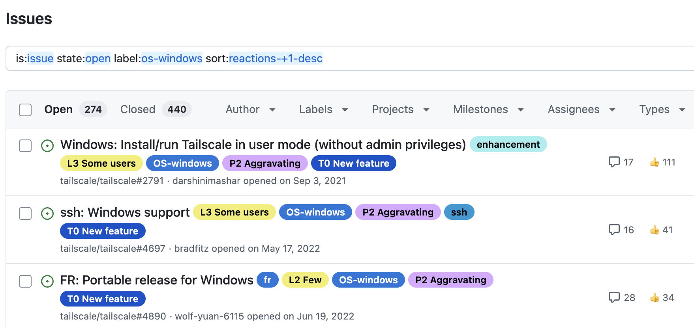
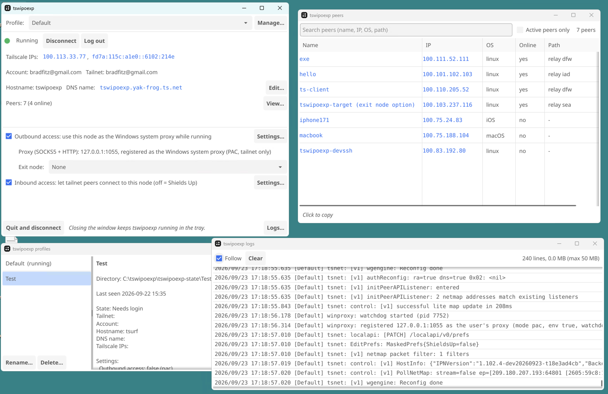
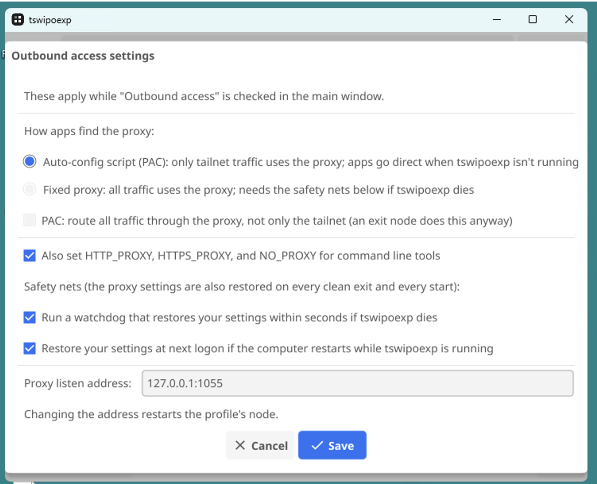
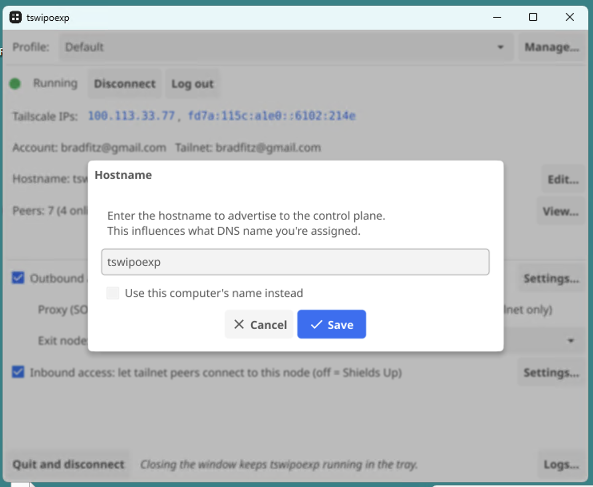

# tswipoexp: a Tailscale Windows Portable Experiment

Hi, this is Brad, a human writing words in a GitHub README.md. (Pretty novel these days!)

This repo is an experimental Windows Tailscale client with a totally opposite design
from the official Windows Tailscale client. Notably, it addresses the top three
[highest-voted Windows issues](https://github.com/tailscale/tailscale/issues?q=is%3Aissue+state%3Aopen+label%3Aos-windows+sort%3Areactions-%2B1-desc)
on the Tailscale issue tracker:

* [#2791: Install/run Tailscale in user mode (without admin privileges)](https://github.com/tailscale/tailscale/issues/2791)
* [#4697: ssh: Windows support](https://github.com/tailscale/tailscale/issues/4697)
* [#4890: Portable release for Windows](https://github.com/tailscale/tailscale/issues/4890)

## Portable

That last one ("Portable release") deserves some explanation, in case
you're also not a Windows person and don't know that vocabulary.

As a Linux person, when I see "portable" I think "can be compiled to
other platforms or architectures" or think "Huh? Aren't Windows
binaries already [Portable
Executables](https://en.wikipedia.org/wiki/Portable_Executable)?"

But no. That's not what Windows people mean when they say
"Portable". To them, a portable binary is one that:

* doesn't require installation
* doesn't require root (er, Administrator)
* doesn't write all over the registry and keeps any config/state files local to the binary

Basically: it's a binary you can put on a USB stick and move from computer to
computer as a regular user.

But that's the polar opposite of the official Tailscale Windows client, which:

* requires installation
* requires running as a LOCALSYSTEM Service
* writes to `%PROGRAMDATA%` and the registry, etc
* requires the [Wintun](https://www.wintun.net/) DLL

etc.

## The Experiment

So this repo's an experiment at a totally different type of Windows client
that requires none of that.

It runs as a regular user off a USB stick.

## Warnings, Disclaimer

While I, a human, am writing this README, I wrote none of the code and
barely even reviewed any of it. It might be the sloppiest vibiest slop ever
but I'll never know, because I'm not planning on reading it all. It seems
to work, and it satisfies my curiosity, answering the question: can a Tailscale
Windows client work like this? (The answer: seems like it!)

I should proactively declare that this might have security problems and that
it's not really maintained. You're welcome to use it, bugs and all.

## How it works

All networking is in userspace with gVisor's netstack. Incoming and outgoing
traffic can be individually enabled.

Incoming traffic just TCP proxies to localhost (TCP is not end-to-end,
but stitched, so local applications see 127.0.0.1 as the remote address
instead of the real Tailnet peer IP).

Outgoing traffic uses SOCKS5 and/or HTTP proxies, as you configure. It
uses various Windows APIs to register itself with your local user
session, which certain Windows app respect and some don't. So it can
also set environment variables, which different sets of apps respect.

It uses [Fyne.io](https://fyne.io/) for its GUI, because a Windows program
needs a GUI, of course.

Internally, the whole thing is just a [tsnet
app](https://tailscale.com/docs/features/tsnet). It's a GUI on top of
a tsnet.Server.

## Screenshots

Here's some screenshots as of 2026-09-23. I haven't really been trying to make it
beautiful. Just not incredibly ugly.

